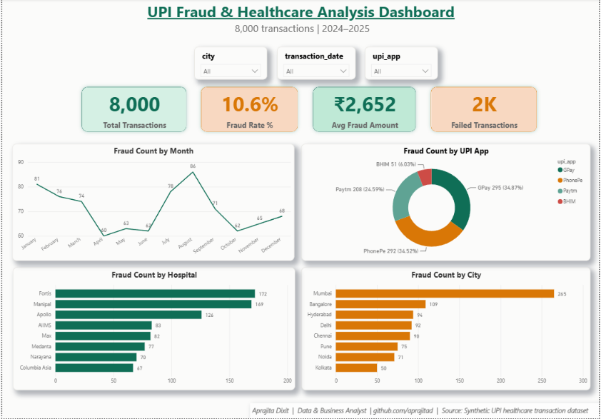

# 🩺 UPI Fraud & Healthcare Data Analysis (SQL + Python + Power BI)


**Dataset:** 8,000 UPI healthcare transaction records (2024–2025)
**Dashboard:** Power BI (see `power_bi/UPI_Fraud_Healthcare_PowerBI.pbix`)

---

## 🖼️ Dashboard Preview



---

## 📌 Business Problem

Indian hospitals and clinics increasingly accept UPI payments, but fraud and payment failures create real financial and operational risk. This project answers three questions a healthcare finance team would actually ask:

1. How much of our transaction volume is fraudulent, and where is it concentrated?
2. Can fraud be predicted from transaction metadata alone, before it happens?
3. What operational changes would reduce fraud exposure?

---

## 📁 Dataset

📂 **Location:** `data/upi_fraud_healthcare_cleaned.csv` — 8,000 UPI healthcare transactions spanning 2024–2025, across 8 hospitals and 8 cities, with hospital, city, patient, payment method, status, and fraud-flag fields.

---

## 🛠 Tools & Technologies

| Category | Tools / Libraries |
|----------|------------------|
| Data Cleaning + Wrangling | Python, Pandas |
| SQL Analysis | SQLite |
| Fraud Detection Models | Scikit-learn (Logistic Regression, Isolation Forest) |
| Visualization | Matplotlib, Power BI |
| Notebook Environment | Jupyter Notebook |

---

## 📊 Approach

### 1. Data Preparation
Cleaned and typed the data, parsed transaction dates, and derived a binary fraud flag for modeling.

### 2. Exploratory Data Analysis
Fraud counts by hospital, city, and UPI app; monthly fraud trend; correlation between transaction amount, patient age, and fraud.

### 3. SQL Analytics
Ten queries in `sql/sql_queries.sql` — including a window-function query ranking hospitals by fraud *rate* rather than raw count — reproduce the core metrics independently of the Python analysis.

### 4. Supervised Fraud Detection Model
Trained a Logistic Regression classifier (`class_weight="balanced"`, features scaled with `StandardScaler`) to test whether fraud is predictable from transaction metadata alone.

### 5. Unsupervised Anomaly Detection
Trained an Isolation Forest — without ever seeing the fraud labels — to check whether fraud shows up as a detectable anomaly on its own, which matters in real-world settings where labeled fraud data isn't always available.

### 6. Power BI Dashboard
Interactive report with fraud KPIs, monthly trend, fraud by hospital/city/UPI app, and slicers for city, UPI app, and month.

📂 **Power BI File:** `power_bi/UPI_Fraud_Healthcare_PowerBI.pbix`

---

## 🔍 Key Insights

- **10.6%** of all transactions were flagged as fraudulent
- Fraud is concentrated in **Fortis** and **Manipal** hospitals and in **Mumbai**-based transactions
- Fraudulent transactions average roughly **₹2,652**
- **`transaction_status`** (failed vs. successful) is by far the strongest single predictor of fraud, both in the SQL breakdown and in the model's feature importance
- Network and timeout issues account for the majority of transaction failures

---

## 🤖 Model Results

| Model | ROC-AUC | Recall (Fraud) | Precision (Fraud) |
|---|---|---|---|
| Logistic Regression (supervised) | 0.64 | 0.48 | 0.20 |
| Isolation Forest (unsupervised, no labels used) | — | ~0.17 overlap with actual fraud | — |

**Honest read on these numbers:** the supervised model performs better than random guessing (ROC-AUC 0.64) but isn't strong enough to act on autonomously — it catches under half of fraud cases and false-alarms on 4 out of 5 flagged transactions. The unsupervised model performs even more modestly. This is a realistic, not inflated, result: transaction metadata alone provides a real but limited fraud signal. See **Limitations** below for what would improve this.

---

## 💡 Business Recommendations

| # | Recommendation | Rationale |
|---|---|---|
| 1 | Add manual review triggers for failed, high-value transactions | Failed transactions carry a disproportionately high fraud rate |
| 2 | Prioritize fraud-monitoring resources on Mumbai transactions and the Fortis/Manipal hospital networks | These segments show concentrated fraud risk |
| 3 | Use the fraud model as a triage signal, not an automated block | Current precision (0.20) means most flags will be false positives — the model should support, not replace, human review |
| 4 | Invest in richer data collection (device ID, transaction frequency, location) before expanding automated fraud detection | Metadata-only models plateau around ROC-AUC 0.64; behavioral features are where real gains would come from |

---

## ⚠️ Limitations

- Dataset is **synthetically generated** for portfolio purposes — patterns are realistic but not from real transactions
- No behavioral/device-level features (transaction frequency, device ID, location history) — only transaction metadata was available
- Class imbalance (~10.6% fraud) means precision/recall trade-offs are unavoidable without richer features
- Logistic Regression was chosen for interpretability; a production system would likely use a tree-based model (e.g. XGBoost) with resampling techniques for the imbalance

---

## ▶️ How to Run the Project

### 1️⃣ Clone the Repository
```bash
git clone https://github.com/aprajitad/UPI-Fraud-Healthcare-Data-Analysis.git
cd UPI-Fraud-Healthcare-Data-Analysis
```

### 2️⃣ Install Required Libraries
```bash
pip install pandas matplotlib scikit-learn jupyter
```

### 3️⃣ Run the Notebook
Open `notebooks/upi_fraud_healthcare_analysis.ipynb` — loads data from `data/upi_fraud_healthcare_cleaned.csv`, runs the full EDA, and trains/evaluates both fraud detection models.

### 4️⃣ Run SQL Analysis
Load `sql/sql_queries.sql` into SQLite (or any SQL client) to reproduce the summarized analytics.

### 5️⃣ Open the Power BI Dashboard
Open `power_bi/UPI_Fraud_Healthcare_PowerBI.pbix` in Power BI Desktop.

---

## 📂 Repository Structure

```
UPI-Fraud-Healthcare-Data-Analysis/
│
├── data/
│   └── upi_fraud_healthcare_cleaned.csv
│
├── notebooks/
│   └── upi_fraud_healthcare_analysis.ipynb
│
├── sql/
│   └── sql_queries.sql
│
├── power_bi/
│   └── UPI_Fraud_Healthcare_PowerBI.pbix
│
├── dashboard_preview.png
└── README.md
```

---

## 👤 Author

**Aprajita Dixit**
Data & Business Analyst | SQL | Python | Power BI

- **LinkedIn:** [linkedin.com/in/dixitaprajita](https://www.linkedin.com/in/dixitaprajita/)
- **GitHub:** [@aprajitad](https://github.com/aprajitad)
